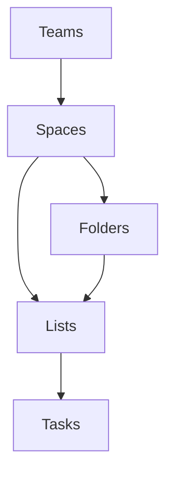

<!-- readme template  from https://github.com/othneildrew/Best-README-Template -->
<a name="readme-top"></a>

<div align="center">

  [![Contributors][contributors-shield]][contributors-url]
  [![Forks][forks-shield]][forks-url]
  [![Stargazers][stars-shield]][stars-url]
  [![Issues][issues-shield]][issues-url]
  [![MIT License][license-shield]][license-url]

  <br />
  <a href="https://github.com/BIOS9/ClickUpAPI">
    
  </a>

  <h3 align="center">ClickUpAPI</h3>
  <p align="center">
    An unofficial .NET wrapper for the ClickUp V2 API.
    <br />
    <br />
    <a href="#getting-started">Quickstart Guide</a>
    ·
    <a href="https://github.com/BIOS9/ClickUpAPI/issues">Report Bug</a>
    ·
    <a href="https://github.com/BIOS9/ClickUpAPI/issues">Request Feature</a>
  </p>
</div>
<br />


<!-- GETTING STARTED -->
## Getting Started

Follow the steps below to install and use this library.

### Prerequisites

* .NET SDK
* ClickUp Personal Token or OAuth2 Credentials

  The ClickUp API requires authentication, so you will need credentials to use this library. Visit the [ClickUp authentication documentation](https://clickup.com/api/developer-portal/authentication/) for more info.

### Installation

All you have to do is install the NuGet package into your project!
```sh
dotnet add package BIOS9.ClickUp
```

<p align="right">(<a href="#readme-top">back to top</a>)</p>


<!-- USAGE EXAMPLES -->
## Usage

Replace the API key values in these examples with your own.

### Reading from the API
```csharp
var apiKey = "pk_1234567_ABCDEFGHIJKLMNOPQRSTUVWXYZ12345"
var client = new ClickUpClient(apiKey);

// Get all teams that are accessible with the current API key.
var teams = await client.GetAuthorizedTeamsAsync();
Console.WriteLine("Team: " + teams.First().Name);

// Get spaces within the first team.
var spaces = await teams.First().GetSpacesAsync();

// Get folders within the first space
var folders = await spaces.First().GetFoldersAsync();

// etc... Refer to the ClickUp structure diagram below for more info on which objects you can get from the API.
```

### Creating stuff
```csharp
var apiKey = "pk_1234567_ABCDEFGHIJKLMNOPQRSTUVWXYZ12345"
var client = new ClickUpClient(apiKey);

// Get team to create space in.
var myCoolTeam = await client.GetAuthorizedTeamsAsync().First();

// Create space with a name.
var mySpace = await myCoolTeam.CreateSpaceAsync(p =>
{
    p.Name = "My brand new space";
});

Console.WriteLine(mySpace.Id);
Console.WriteLine(mySpace.Name);
```

### Modifying existing stuff
```csharp
var apiKey = "pk_1234567_ABCDEFGHIJKLMNOPQRSTUVWXYZ12345"
var client = new ClickUpClient(apiKey);

// Get first space in the first team.
var team = await client.GetAuthorizedTeamsAsync().First();
var mySpace = await client.GetAuthorizedTeamsAsync().First();

// Change the name of the space
await mySpace.ModifyAsync(p =>
{
    p.Name = "Replacement name";
});

// The mySpace object will also have it's name updated
Console.WriteLine(mySpace.Name);
```


### ClickUp Object Structure
ClickUp uses the following simplified layout for objects, and this library aims to mimic it.



<p align="right">(<a href="#readme-top">back to top</a>)</p>


<!-- LICENSE -->
## License

Distributed under the MIT License. See `LICENSE.md` for more information.

<p align="right">(<a href="#readme-top">back to top</a>)</p>


<!-- ACKNOWLEDGMENTS -->
## Acknowledgments

  * Library structure heavily inspired by [Discord.Net](https://github.com/discord-net/Discord.Net)

<p align="right">(<a href="#readme-top">back to top</a>)</p>


[contributors-shield]: https://img.shields.io/github/contributors/BIOS9/ClickUpAPI.svg?style=for-the-badge
[contributors-url]: https://github.com/BIOS9/ClickUpAPI/graphs/contributors
[forks-shield]: https://img.shields.io/github/forks/BIOS9/ClickUpAPI.svg?style=for-the-badge
[forks-url]: https://github.com/BIOS9/ClickUpAPI/network/members
[stars-shield]: https://img.shields.io/github/stars/BIOS9/ClickUpAPI.svg?style=for-the-badge
[stars-url]: https://github.com/BIOS9/ClickUpAPI/stargazers
[issues-shield]: https://img.shields.io/github/issues/BIOS9/ClickUpAPI.svg?style=for-the-badge
[issues-url]: https://github.com/BIOS9/ClickUpAPI/issues
[license-shield]: https://img.shields.io/github/license/BIOS9/ClickUpAPI.svg?style=for-the-badge
[license-url]: https://github.com/BIOS9/ClickUpAPI/blob/main/LICENSE.md
[Next.js]: https://img.shields.io/badge/next.js-000000?style=for-the-badge&logo=nextdotjs&logoColor=white
[Next-url]: https://nextjs.org/
[React.js]: https://img.shields.io/badge/React-20232A?style=for-the-badge&logo=react&logoColor=61DAFB
[React-url]: https://reactjs.org/
[Vue.js]: https://img.shields.io/badge/Vue.js-35495E?style=for-the-badge&logo=vuedotjs&logoColor=4FC08D
[Vue-url]: https://vuejs.org/
[Angular.io]: https://img.shields.io/badge/Angular-DD0031?style=for-the-badge&logo=angular&logoColor=white
[Angular-url]: https://angular.io/
[Svelte.dev]: https://img.shields.io/badge/Svelte-4A4A55?style=for-the-badge&logo=svelte&logoColor=FF3E00
[Svelte-url]: https://svelte.dev/
[Laravel.com]: https://img.shields.io/badge/Laravel-FF2D20?style=for-the-badge&logo=laravel&logoColor=white
[Laravel-url]: https://laravel.com
[Bootstrap.com]: https://img.shields.io/badge/Bootstrap-563D7C?style=for-the-badge&logo=bootstrap&logoColor=white
[Bootstrap-url]: https://getbootstrap.com
[JQuery.com]: https://img.shields.io/badge/jQuery-0769AD?style=for-the-badge&logo=jquery&logoColor=white
[JQuery-url]: https://jquery.com 
